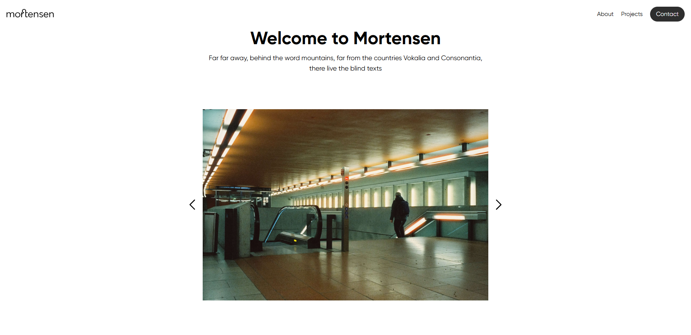

# Mortensen Hiring Test

This repository contains the solution for the Mortensen front-end hiring test.

## Features

- **Tailwind CSS** for rapid UI development
- **Custom Gilroy font** integration
- **Responsive navigation** with a functional burger menu for mobile

## Getting Started

1. **Install dependencies**  
   _(If you want to use PostCSS or Tailwind CLI features)_

   ```bash
   npm install
   ```

2. **Build Tailwind CSS**

   ```bash
   npx @tailwindcss/cli -i ./src/input.css -o ./src/output.css --watch
   ```

3. **Open `src/index.html` in your browser**  
   For best results, use a local server (e.g., `Live Server`) or open the html file in your browser.

## Folder Structure

```
mortensen-hiring-test/
├── src/
│   ├── input.css         # Tailwind and custom CSS
│   ├── output.css        # Generated CSS (do not edit)
│   ├── index.html        # Main HTML file
│   ├── assets/
│   │   └── fonts/        # Gilroy font files
│   └── partials/         # Icons and reusable HTML
├── tailwind.config.js    # Tailwind configuration
└── README.md
```

## Notes

- The burger menu is functional on mobile.
- The Gilroy font is loaded from `src/assets/fonts/`.
- For the image carousel, include [Swiper.js](https://swiperjs.com/) as described in the code comments.

---

**Author:** Franck Cai  
**For:** Mortensen hiring
